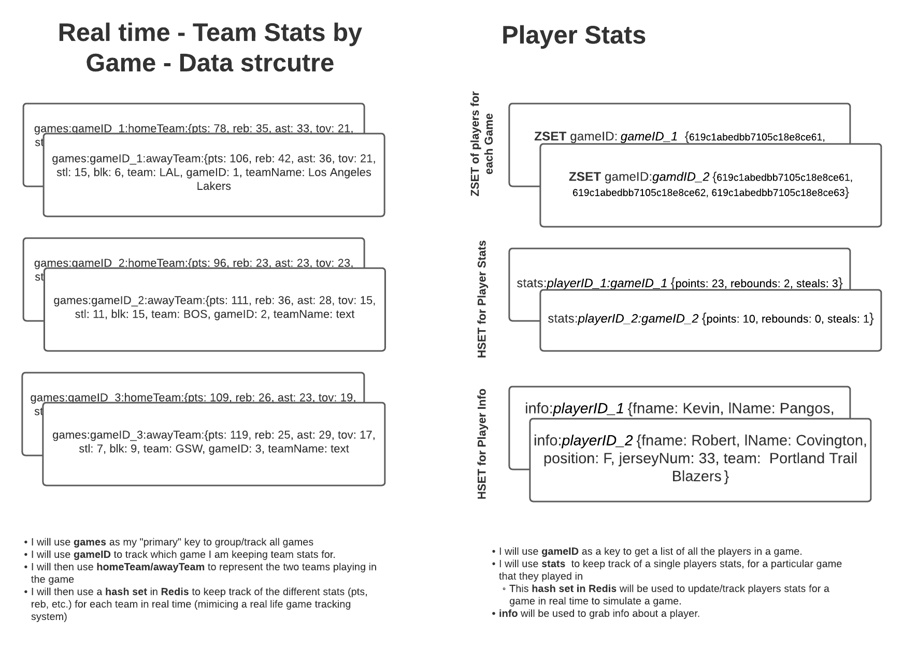

# nbaDatabase - Authors [Daniel Lisko](https://github.com/djlisko01) and [Michael Chang](https://github.com/michaelchang106)

## NBA database for DBMS Project 3 - CS 5200

## Business Requirements and Logical/Conceptual Models

[Business Requirements PDF](./BusReq_Heirarchal_tables/Business_Requirements_and_Models_and_BCNF.pdf)

[Business Requirements in Google Docs](https://docs.google.com/document/d/13wTtEmC-XXSWzubHSJDg0rDB8sXb62t-KJJM-X4vpMg/edit?usp=sharing)

### Conceptual Model

[Conceptual Model Lucid Chart](https://lucid.app/lucidchart/728904b6-3eac-41ee-9c80-cc89d811dc4c/edit?viewport_loc=-449%2C-71%2C3131%2C1496%2C0_0&invitationId=inv_bc674f57-3cb0-483b-8c06-247711741271)

### Heirarchal Model

[Heirarchal Model PDF](./BusReq_Heirarchal_tables/NBA-HeiarchalTables-JSON-Examples.pdf)

[Heirarchal Model Lucid Chart](https://lucid.app/lucidchart/e3295927-79f1-4176-bfd1-29a7fae585fe/edit?viewport_loc=-3080%2C-56%2C3328%2C1400%2C0_0&invitationId=inv_60206c0a-d083-4538-a24a-087f8aac8f4d)

### In-Memory Data Structure

[In-Memory Data Structure PDF](./BusReq_Heirarchal_tables/In_Memory_Data_Structure.pdf)

[In-Memory Data Structure Lucid Chart](https://lucid.app/lucidchart/38269d65-a1f8-4014-9d74-8b90e225a611/edit?viewport_loc=-183%2C-61%2C2219%2C999%2C0_0&invitationId=inv_4ccc9d73-d882-4d47-81a1-9a3ba49941f4)

## Division of works and tasks

### Both team members collaborated and contributed evenly on the design and implementation of the database with MongoDB, LucidChart, and Google Suite

### [Michael Chang](https://github.com/michaelchang106) created the CRUD Operations and interface for Real Time Team Stats tracking by Game.

#### Files Implemented for Redis:

- Database:

  - [nbaDBRedisManager.js](./database/nbaDBRedisManager.js)

- Routes:

  - [editTeamStats.js](./routes/editTeamStats.js)

- Views
  - [teamStats.ejs](./views/teamStats.ejs)
  - [editTeamStats.ejs](./views/editTeamStats.ejs)

### [Daniel Lisko](https://github.com/djlisko01) created the CRUD Operations and interface for Real Time Player Stats tracking.

#### Files Implemented for Redis:

- Database:

  - [myRedisManager.js](./database/myRedisManager.js)

- Routes:

  - [playerStats.js](./routes/playersStats.js)

- Views
  - [playerGameEdits.ejs](./views/playerGameEdits.ejs)
  - [teamSchedule.ejs](./views/teamSchedule.ejs)
  - [playerStats.js](./views/playerStats.ejs)

## Execution of project

- Download the code to your preferred directory
- Open that directory with your preferred terminal
- type "npm install" and hit enter

### Load Database and data with mongorestore / mongodump & start node-express server

- [follow guide to install mongo](https://docs.mongodb.com/manual/tutorial/manage-mongodb-processes/)
- TLDR:
  - "brew tap mongodb/brew"
  - "brew install mongodb-community@5.0"
  - "brew services start mongodb-community@5.0"
- type "npm start" and hit enter
  - mongoDB data should be restored using "mongorestore", if failed, type "mongorestore" manually in terminal

## Start redis and mongo server if they aren't already started

### To start MongoDB server

- Open a terminal and go to the database directory.
- make a directory called "db/"
- run mongod --dbpath= db/

### To start Redis server

- In the terminal, redirect to the dump/ directory
- type redis-server

### Load In Memory Database with [dump.rdb](./dump/dump.rdb)

- [follow guide to install redis](https://medium.com/@petehouston/install-and-config-redis-on-mac-os-x-via-homebrew-eb8df9a4f298)
- TLDR:
  - "brew install redis"
  - copy [dump.rdb](./dump/dump.rdb) to your Redis directory
    - find your Redis directory by typing "redis-cli config get dir"
  - type "redis-server" to start server on localhost:6739

### User interface to perform CRUD operations on the Redis DB

- navigate to "http://localhost:3000/" in your preferred browser
- use our developed interface to perform CRUD operations on the Team stats by Game or Player stats
